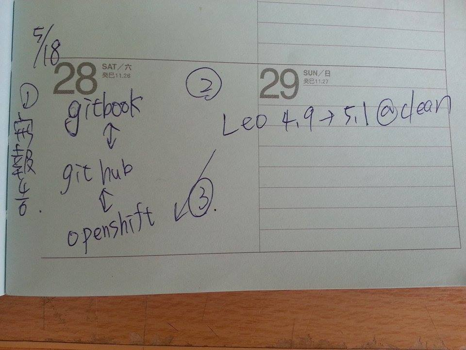

# week12

[waffle](https://waffle.io/40123248/2015cdb_g10)

[github](https://github.com/40123248/2015cd_midterm2)

[gitbook](http://40123248.gitbooks.io/2015cdb_g10/content/week11.html)

40123248

這週我們起先先研究出上次期中報告沒辦法畫出的第二個齒輪的問題

發現問題

1.

```
ctx.save()
ctx.translate(400, 400)
ctx.rotate(pi/2)
gear(0, 0,''' + str(total) + ',' + str(b) +  ''',"blue")
ctx.restore()
ctx.save()
ctx.translate(400 + ''' + str(2*total) + ''',400)
ctx.rotate(-(pi/2) -pi/ '''  + str(b) + ''')
gear(0, 0,''' + str(total) + ',' + str(b) +  ''',"blue")
ctx.restore()
```

發現 直接寫上
```
gear(400,400 + ''' + str(2*total) +','+ str(b) +  ''',"blue")
```
即可劃出另一齒輪 此程式碼的意思是 在x軸上兩個半徑後的點劃出一個齒輪 不過無法咬合

之後參考旋轉的指令 我們先`ctx.translate`到400 400 再旋轉Pi/2的角度後 以0 0畫出齒輪
接下來重新 一次步驟 `ctx.translater` 到400+兩倍節圓半徑
再逆時針轉`Pi/2 + 一齒的角度` 一樣以0 0畫出齒輪

    
即可得到旋轉的同樣齒輪相嚙合   完成

[重做齒輪嚙合vimeo](https://vimeo.com/128368365)
    
    
開始進行   w12 功課

組員們已全員進行過手動組立的練習並上傳至vimeo

[40123248](https://vimeo.com/128120346)

[40123240](https://vimeo.com/128120001)

[40123237](https://vimeo.com/128119569)

[40123234](https://vimeo.com/128120337)

[40123247](https://vimeo.com/128982838) creo程式過期 之後補上 5/27 已補上

40123143


自動組立過程

照著影片 先將main跟main2下載下來放入自己的資料內 開始修改程式碼

發現問題

1.
```
<meta http-equiv="content-type"
content="text/html;charset=utf-8">
<script type="text/javascript"
src="/static/weblink/wl_header.js"></script>
<script type="text/javascript"
src="/static/weblink/pfcUtils.js"></script>
```
    
這邊的問題是 原本的程式碼的路徑叫出並不正確 修改後再貼上

2.

```
var descr = pfcCreate("pfcModelDescriptor").CreateFromFileName ("v:/home/lego/man/"+part2);
```

將樂高的零組件解壓縮到這個路徑的資料夾(lego)內就可以了

3.
creo壞了

開不起來 好像是沒購買

評分

第10組  2015cdb_g10 組別自評19分

40123248  自評19分 

心得: 將上次的作業完成了 有成就感             這次因為美中不足的是不能開creo 只有手動組立的影片 所以自評19

40123240  自評18分

心得:完成手動組立樂高，雖然一開始有些地方無法順利完成組立，後來看著之前別人拍的影片順利完成組立並且拍攝成影片，完成2個齒輪的嚙合，creo因為過期而無法開啟，自動組立部分目前尚未完成。

40123237  自評19分


心得：手動組立樂高。花了一些時間研究以及拍影片，但完成之後非常有成就感。沒辦法自動組立，好像是因為沒有購買所以無法開啟，下次有機會要試試。


40123234   自評 18分

課堂筆記如下圖



心得：這週手動組立樂高，之前修課有組過，所以這次操作起來比較快，也比較熟悉，這次知道如何自動組立，不過因為creo過期無法使用，所以沒辦法驗證自己是否學會自動組立的步驟。

40123247   自評 18分

研究齒輪囓合原理，我們參考了原本的程式然後繪出一顆囓合的齒輪，結果很滿意。
有關creo樂高組立，手動組立已經完成但是還沒拍攝手動組立影片，因為電腦的creo似乎已經過期了，所以我無法順利開啟。自動組立方面已經研究好老師的影片，但由於軟體問題，只好暫時停工。
    
    
    
    
    
    
    
    
    
    
    
    
    
    
    
